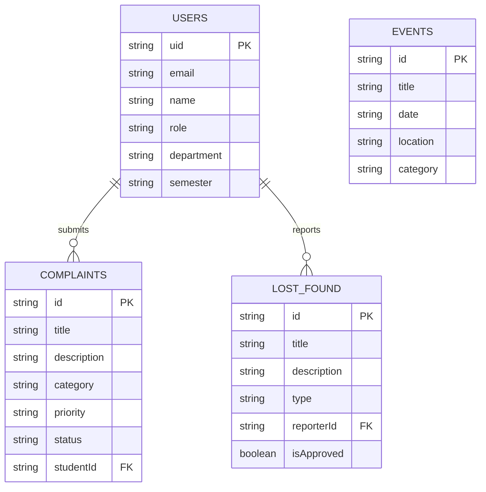
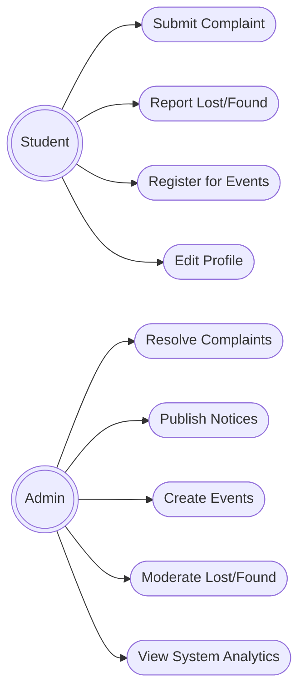
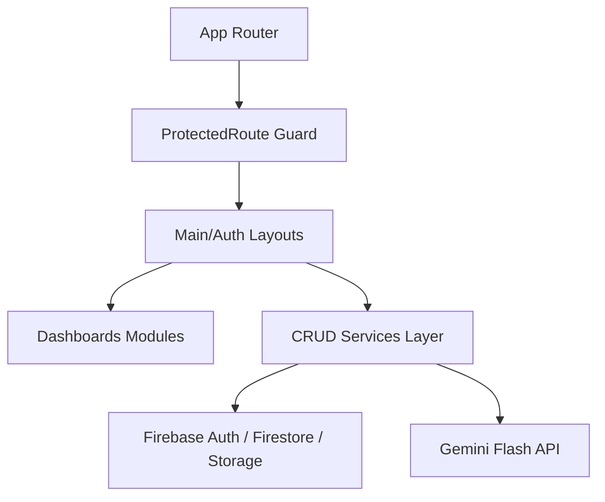

# Smart Campus Management System

A production-quality, secure, and modern SaaS-like web application designed to digitize essential campus services. Built as a 3rd Year B.Tech Computer Science Semester Mini Project, it showcases clean architecture, role-based access control, responsive UI/UX, and AI integrations.

---

## 🚀 Key Modules
1. **Authentication (RBAC)**: Secure student/admin sign-in, session preservation ("Remember Me"), registration validation.
2. **Dynamic Dashboards**: Stats counters, interactive graphs (ChartJS), recent operations log, and quick action cards.
3. **Complaint Cell**: Submission form with file upload control (format validation + size limits), progress tracking timeline, and administrative resolution actions.
4. **Lost & Found Board**: Categorized bulletin feed with search, contact finder modal, resolve toggles, and admin spam moderation queues.
5. **Notice Board**: Pinned/emergency announcements, search, and integrated Gemini AI notice summarizers.
6. **Events Calendar**: Event registries with live countdown timers, seat utilization progress bars, and participation credentials download.
7. **Emergency Contacts**: One-click dial directory for crucial campus cells.
8. **Student Profile Settings**: Update details, avatar picture, and change password tab.

---

## 🛠️ Tech Stack
- **Frontend**: React (Vite), Tailwind CSS v4, React Router v7, React Hook Form, Framer Motion, Chart.js, SweetAlert2, React Toastify, React Icons
- **Backend (Firebase)**: Authentication, Cloud Firestore, Cloud Storage
- **AI Integrations**: Gemini 1.5 Flash API (with regex-based local summarization fallback)

---

## 📂 Project Directory Structure

```
smart-campus-management-system/
├── public/
├── src/
│   ├── assets/               # Local icons, default avatars, branding
│   ├── components/           # Reusable UI elements
│   │   ├── common/           # Card, Button, Loading Skeletal components
│   │   └── dashboard/        # Countdown widgets
│   │   └── navigation/       # Collapsible Sidebar & Topbar
│   ├── layouts/              # Auth and Main dashboards wrappers
│   ├── pages/                # Pages directories
│   │   ├── auth/             # Login & Register views
│   │   ├── complaints/       # Lists, forms and details timelines
│   │   ├── lostfound/        # Moderation queues & listings
│   │   ├── notices/          # Bulletin boards
│   │   ├── events/           # Countdown calendars
│   │   ├── emergency/        # Direct dial cells
│   │   ├── profile/          # General details & passwords
│   │   └── errors/           # 404, Unauthorized guards
│   ├── hooks/                # useAuth and useTheme custom hooks
│   ├── services/             # Firebase CRUD APIs & Gemini AI services
│   ├── firebase/             # Config & Mock database loaders
│   ├── context/              # Auth & Theme providers
│   ├── utils/                # Date and file upload validation helpers
│   ├── App.jsx               # Routing resolution root
│   └── main.jsx              # React mounting root
├── firestore.rules           # DB Security Rules
├── storage.rules             # File Uploads Rules
├── vite.config.js
├── .env.example              # Environments template
└── README.md
```

---

## 📖 Installation Guide

### Prerequisites
- Node.js (v18 or higher)
- npm or yarn

### Setup Steps
1. **Clone the repository**:
   ```bash
   git clone https://github.com/your-username/smart-campus-management-system.git
   cd smart-campus-management-system
   ```
2. **Install dependencies**:
   ```bash
   npm install
   ```
3. **Configure Environment Variables**:
   Create a `.env` file in the root directory and replicate the variables from `.env.example`.
4. **Run local developer server**:
   ```bash
   npm run dev
   ```
   Open [http://localhost:5173](http://localhost:5173) in your browser.

---

## 🔒 Environment Variable Guide

To run the application with full Firebase connection, replace the placeholder credentials in your `.env` file:

```env
# Firebase credentials
VITE_FIREBASE_API_KEY=AIzaSyA1...
VITE_FIREBASE_AUTH_DOMAIN=smart-campus-123.firebaseapp.com
VITE_FIREBASE_PROJECT_ID=smart-campus-123
VITE_FIREBASE_STORAGE_BUCKET=smart-campus-123.appspot.com
VITE_FIREBASE_MESSAGING_SENDER_ID=987654321
VITE_FIREBASE_APP_ID=1:9876:web:1234abcd

# Optional: Gemini API Key for AI notice summarization
VITE_GEMINI_API_KEY=AIzaSyD-GeminiKeyHere...
```

> [!NOTE]
> **Out-of-the-Box Fallback**: If these environment keys are missing or set to defaults, the application automatically runs in **Local Mock Mode**. It loads sample events, notices, and directory cells into the browser's `localStorage` so you can test all CRUD operations, complaints, profile updates, and admin dashboards immediately without a database setup!

---

## 🗄️ Database Schema & Collections

### 1. `users`
- `uid` (String, Doc ID)
- `email` (String)
- `name` (String)
- `role` (String: `'student'` | `'admin'`)
- `department` (String)
- `semester` (String)
- `phoneNumber` (String)
- `profilePicUrl` (String)
- `createdAt` (Timestamp)

### 2. `complaints`
- `id` (String, Doc ID)
- `title` (String)
- `description` (String)
- `category` (String: `'academic'` | `'hostel'` | `'maintenance'` | `'security'` | `'others'`)
- `priority` (String: `'low'` | `'medium'` | `'high'` | `'urgent'`)
- `status` (String: `'pending'` | `'in-progress'` | `'resolved'` | `'rejected'`)
- `imageUrl` (String)
- `studentId` (String)
- `studentName` (String)
- `adminResponse` (String)
- `timeline` (Array of Map Objects: `{status, message, timestamp}`)

### 3. `lostFound`
- `id` (String, Doc ID)
- `title` (String)
- `description` (String)
- `type` (String: `'lost'` | `'found'`)
- `category` (String: `'electronics'` | `'documents'` | `'keys'` | `'clothing'` | `'bags'` | `'others'`)
- `location` (String)
- `date` (String)
- `imageUrls` (Array of Strings)
- `reporterId` (String)
- `isApproved` (Boolean)

---

## 📊 Diagrams

### ER Diagram


### Use Case Diagram


### Component Diagram


---

## 🛡️ Firebase Security Rules

Strict rules are enforced to protect database endpoints:

### Firestore Rules Summary
- **Users**: Read access allowed for all logged-in users. Write access only for doc owners or admins.
- **Complaints**: Read/write allowed only for owners or admins. Students cannot modify the ticket `status` field after submission.
- **Notices**: Read access allowed for all. Write/delete restricted to admin role.
- **Lost & Found**: Read access allowed for approved items. Write allowed for creators. Admins retain full moderation control.

### Storage Rules Summary
- Upload size limited to **5 MB**.
- Content-type filtered to allow only **JPG, JPEG, PNG, WEBP** image formats.

---

## 🔮 Future Scope
- **Real-Time Group Chatrooms**: Integration of Firebase Cloud Messaging or socket channels for student-to-admin direct chatrooms.
- **IoT Smart Parking Integration**: Live slots visualization widgets on student dashboards.
- **Automated Certificate Generation**: Using HTML Canvas to auto-compile and email real PDFs of participation credentials to registered students.
